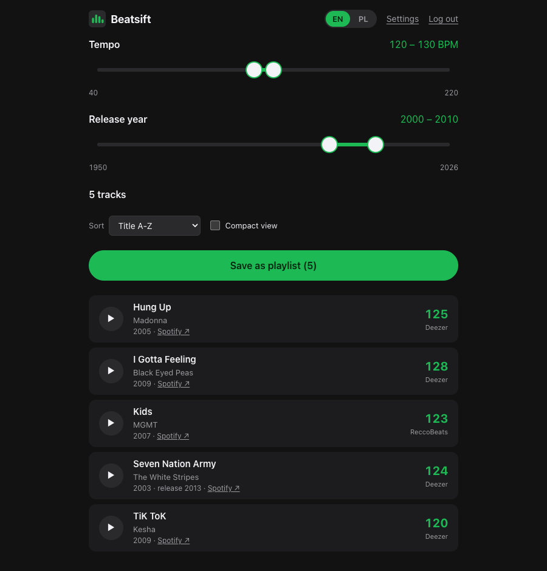

# Beatsift

<!-- prettier-ignore-start -->

[](https://github.com/piecioshka/spotify-beatsift/actions/workflows/ci.yml)
[](https://github.com/piecioshka/spotify-beatsift/actions/workflows/pages.yml)
[](https://piecioshka.mit-license.org)


<!-- prettier-ignore-end -->

🔨 A web app that connects to Spotify, pulls your Liked Songs and lets you sift
out the ones at a given tempo and from a given range of years. Typical use:
"tracks at 120-130 BPM from 2000-2010". You save the result as a new playlist
on your account.

> Give a ⭐️ if this project helped you!

## Live 🌍

The app runs at **[piecioshka.github.io/spotify-beatsift](https://piecioshka.github.io/spotify-beatsift/)**.
It is a Spotify app in development mode, so only accounts added to its user
list can log in. To use it with your own account, run it yourself with your
own Client ID (see below).



## Features ✨

- 🎚️ Two range sliders: tempo in BPM and release year, both remembered between visits
- 🥁 Tempo from Deezer (matched by ISRC) with ReccoBeats as a fallback, because Spotify shut its BPM API down
- 📅 Release year corrected with Deezer data, so a 2003 song from a 2015 compilation still counts as 2003
- 💾 Liked Songs cached in IndexedDB; incremental sync stops at the first known track
- 🔀 Sorting by title, artist, BPM, year or date added _(the same order goes into the playlist)_
- 📋 Compact view that fits each track on one line
- ▶️ In-page playback through the Spotify embed, with automatic advance to the next result
- 💿 One click exports the result as a private playlist on your account
- 🌍 English and Polish interface with a switch in the header
- 🍪 No cookies and no tracking; a consent bar explains what lands in the browser
- 🔐 Login with Authorization Code + PKCE, no client secret and no backend

## Where the BPM comes from

On November 27, 2024 Spotify shut down the `/v1/audio-features` endpoint, the
one that returned the `tempo` field. New apps get a 403 there and there is no
official replacement. Beatsift therefore looks the tempo up elsewhere:

| Order | Source                                      | Match                   | API key    |
| ----- | ------------------------------------------- | ----------------------- | ---------- |
| 1     | [Deezer](https://developers.deezer.com/api) | by the track's ISRC     | not needed |
| 2     | [ReccoBeats](https://reccobeats.com/docs)   | by the Spotify track ID | not needed |

Deezer goes first because an ISRC match is stricter than an ID match.
ReccoBeats fills in whatever Deezer does not know, in batches of 40 tracks.

The two sources can differ by a factor of two, for example 87 versus 174 for
the same track, so every result shows where its number came from.

Deezer does not send an `Access-Control-Allow-Origin` header, so a plain
`fetch` from the browser fails. Beatsift queries it over JSONP
(`?output=jsonp`), which Deezer officially supports. ReccoBeats and Spotify
have CORS enabled.

## Getting started

### 1. Clone and install

```bash
git clone https://github.com/piecioshka/spotify-beatsift
cd spotify-beatsift
npm install
```

### 2. An app in the Spotify Developer Dashboard

1. Go to [developer.spotify.com/dashboard](https://developer.spotify.com/dashboard)
   and click **Create app**. Tick **Web API**.
2. Name: `Beatsift`. **Redirect URI**: `http://127.0.0.1:3000/callback`.
   Since April 2025 Spotify rejects `localhost` and plain `http://`, but a
   loopback address given as an IP still passes.
3. Copy the **Client ID**. No client secret is needed, login uses PKCE.
4. **Settings → User Management** → add the e-mail of your Spotify account.
   Without it your own app returns 403 on login. Development mode allows
   at most 25 manually added accounts.

### 3. Environment variables

```bash
cp .env.example .env
# paste the Client ID into VITE_SPOTIFY_CLIENT_ID
```

### 4. Run

```bash
npm run dev
```

The app is served at `http://127.0.0.1:3000`. The port is fixed because it is
part of the Redirect URI registered in the dashboard; when the port is taken
the server refuses to start instead of silently moving to another one.

## Scripts

| Command                | What it does                                                    |
| ---------------------- | --------------------------------------------------------------- |
| `npm run dev`          | Vite dev server                                                 |
| `npm run build`        | production build into `dist/`                                   |
| `npm run preview`      | preview of the build at the same address                        |
| `npm test`             | unit tests (Vitest)                                             |
| `npm run typecheck`    | type check without emitting                                     |
| `npm run lint`         | ESLint                                                          |
| `npm run format:check` | Prettier                                                        |
| `npm run og-image`     | regenerates the Open Graph image in `public/`                   |
| `npm run favicons`     | regenerates favicon.ico and PNG icons from `public/favicon.svg` |

## Deployment

Every push to `main` builds the app and publishes it to GitHub Pages through
`.github/workflows/pages.yml`. The workflow passes the repository subpath as
`BASE_PATH`, the public address as `VITE_SITE_URL` and the Client ID from the
`VITE_SPOTIFY_CLIENT_ID` repository secret. A copy of `index.html` saved as
`404.html` gives the single-page app its fallback, so the return from login at
`/callback` works even though Pages has no rewrites.

To host it elsewhere, `npm run build` produces static files in `dist/`. Three
things to set up:

- The host must serve `index.html` for every path (the classic SPA fallback),
  otherwise the return from login at `/callback` ends in a 404.
- In the Spotify dashboard add a Redirect URI with the host's domain, for
  example `https://beatsift.example/callback`. The app builds this address
  from the current page on its own; set `VITE_SPOTIFY_REDIRECT_URI` at build
  time when it should be different.
- Set `VITE_SITE_URL` at build time (for example `https://beatsift.example`)
  so that the Open Graph tags point to an absolute image URL. Without it the
  tags use a root-relative path, which most link previews ignore.

## How it works inside

0. **Consent** comes first. The app sets no cookies and does no tracking, but
   it keeps tokens, the library and preferences in `localStorage` and
   IndexedDB, so a bar at the bottom asks before anything is stored. Accept
   is remembered in `localStorage`; reject wipes everything the app has
   written and disables login, and the bar comes back on the next load.
1. **Login** via Authorization Code with PKCE, no client secret. Tokens land
   in `localStorage`. Scopes: `user-library-read` for Liked Songs and
   `playlist-modify-private` for the export.
2. **Sync** walks `GET /v1/me/tracks` in pages of 50 and writes the tracks to
   IndexedDB. Incremental by default, meaning it stops at the first track it
   already knows. A full pass, available in settings, additionally deletes
   from the database whatever you removed from Liked Songs.
3. **BPM lookup** goes through the database in two passes, Deezer and
   ReccoBeats. The queue respects rate limits and saves results after every
   portion, so after closing the tab it resumes where it left off.
4. **Filtering** is a pass over all tracks in memory. A few thousand records
   go through the filter in a fraction of a millisecond, so there is no point
   in building indexes. The list can be sorted (title, artist, BPM, year,
   date added) and switched to a compact view. Slider ranges, sort order,
   view and language persist in `localStorage`. The order of the list is also
   the order of the playlist and of the player.
5. **Playback** from the result list uses the embedded Spotify player
   (iFrame API), with no extra scopes and no Premium. When a track ends the
   next one from the list starts. Full tracks play when you are logged in to
   Spotify in the same browser; otherwise the embed plays 30-second
   previews. The browser may block the automatic start, in which case the
   button inside the player remains.
6. **Export** creates a private playlist and adds the tracks in batches
   of 100.

### The release year can be made up

Spotify reports the release date of the album, not of the track. A song from
2003 that you have from some 2015 compilation gets the year 2015 and falls
out of a 2000-2010 filter. Beatsift rescues this with the date from Deezer,
which is attached to the track, and takes the earlier of the two. It does not
catch everything, but most compilations and remasters yes.

## Limitations

- The Deezer API terms allow non-commercial use only.
- The first sync of a few thousand Liked Songs takes a few minutes, because
  Deezer accepts about 50 requests per 5 seconds. Results stay in the
  database for good, so it is a one-time cost. The tab has to stay open.
- Tracks without an ISRC and local files added to the library are skipped.
- A track without a known tempo or without a release year does not show up
  in the results. If it is not known whether it matches, it does not go into
  the playlist.
- JSONP means a script from Deezer's domain runs inside the page. For a
  personal tool that is acceptable; for a public deployment a proxy of your
  own is the better choice.

## 🤝 Contributing

Contributions, issues and feature requests are welcome!<br /> Feel free to check [issues page](https://github.com/piecioshka/spotify-beatsift/issues/).

## License

[The MIT License](https://piecioshka.mit-license.org) @ 2026
